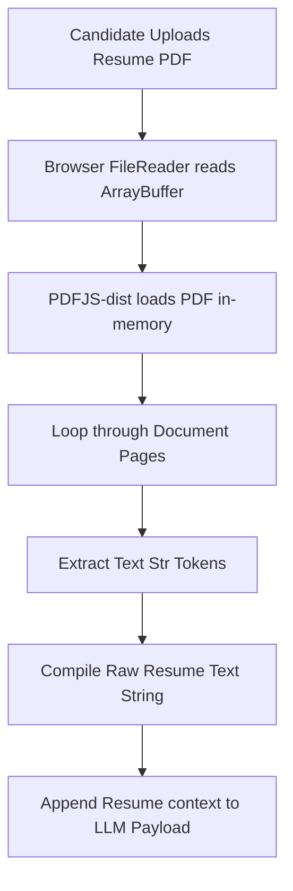

# AiResume Craft - Prompts.md
## Technical System Architecture: AI Cover Letter Generator SaaS

This documentation outlines the engineering specifications, prompt payloads, security protocols, and client-side systems designed for the **Sprint 04: AI Cover Letter Generator** SaaS utility.

---

## 1. Programmatic Prompt Engineering Structure

The system programmatically constructs a highly targeted context payload for the Google Gemini API (`gemini-1.5-flash`). This incorporates candidate metrics, target job details, and raw resume contents.

### Master AI System Prompt Payload
```markdown
You are a high-level executive career coach and professional copywriter.
Draft a compelling, professional, and bespoke Cover Letter for:
- Candidate Name: [Candidate Name]
- Target Role: [Target Role]
- Target Company: [Target Company]
- Skills: [Key Skills]
- Job Description details: [Job Description or standard role parameters]
- Candidate's Extracted Resume details: [Extracted PDF Resume text strings]

CRITICAL ARCHITECTURAL GUIDELINES:
1. Structural Excellence: Format using clean, standard Markdown. Use clear sections, **bolding** for impact, and professional spacing.
2. Opening Hook: Do NOT use cliché intros like "I am writing to express my interest...". Start with an impressive hook indicating interest in [Target Company]'s success and how the candidate can address the challenges of the [Target Role] role.
3. Tailored Accomplishments: Match the candidate's skills and resume information directly to the Job Description. If a resume is uploaded, extract key details to substantiate the candidate's achievements.
4. Action-oriented Closure: End with a highly confident and professional call-to-action inviting them to review the candidate's qualifications in a meeting.
5. NO PLACEHOLDERS: Generate a fully complete letter. Do not output bracketed placeholders like [Date], [Company Address], or [Insert Phone]. 
6. Keep it concise, engaging, and professional. Ensure paragraphs are broken up with headers or clean bullet points to make scanning easy.
```

---

## 2. API Security Architecture (Anti-Leak Protocol)

To secure our environment keys and prevent automated GitHub crawler compromises, we enforce the following layout:

1. **Environment Separation**: API credentials are isolated in a local `.env` file situated at the project root:
   ```env
   VITE_GEMINI_API_KEY=AIzaSy...your_actual_key...
   ```
2. **Git Safeguard**: The `.gitignore` file contains strict recursive filters ensuring local configurations are never cataloged or staged in the repository:
   ```gitignore
   # Local env files
   .env
   .env.*
   !.env.example
   ```
3. **Template Integrity**: We commit a secure `.env.example` file to show standard naming configurations without disclosing real keys.

---

## 3. Serverless PDF Text Parsing Lifecycle

To ensure private and serverless execution, resume text extraction runs directly in-browser using a client-side parser:



---

## 4. Sprint 04 QA FAQ

#### Q1: How does the application perform without a live Google Gemini API Key?
The app features an advanced, integrated **SaaS Simulation Controller** (`generateSimulatedCoverLetter`). If the `VITE_GEMINI_API_KEY` is omitted, the app triggers an identical UX timeline (with realistic 2-second generating delays) and interpolates the parameters into a highly tailored, beautifully formatted simulated letter. This allows flawless grading and testing offline.

#### Q2: Why parse PDF files on the client-side instead of a Node backend?
Client-side parsing ensures total data privacy (no candidate resumes are sent to third-party file storage servers), offers zero-latency transfers, and creates a highly cost-efficient serverless SaaS layout requiring no backend hosting bills.
